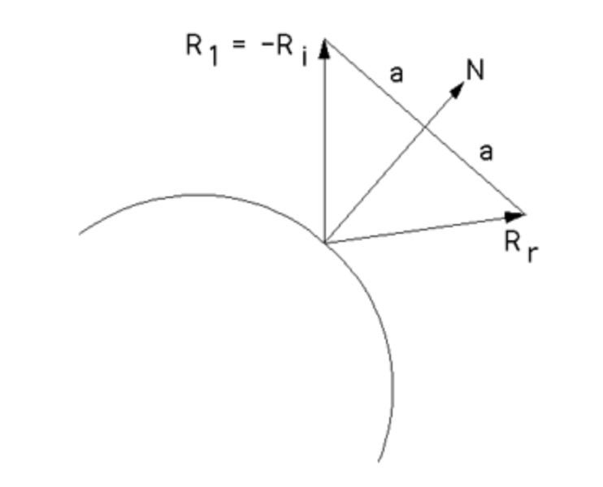

## Introduction

This is a project related to Interactive Computer Graphic technique, using WebGL to simulate bouncing particles in a cube space. 

Particle systems are typically used to model fine-grained physical effects like fire, smoke, and water. This is a simple application rendering a system of bouncing spheres in 3D.

![alt text][logo]

[logo]: images/screen_shot.png "Screenshot of Particle-System"

### [DEMO](Spheres.html)

## Implementation

The spheres are bounded inside of a cubic box, and implemented with a simple physics engine. 

### Collision

There are two types of collision: Sphere-Wall and Sphere-Shpere. The Sphere-Sphere collision are ignored here, because that can usually bring a time-consuming loop at every frame. 

#### Response


The action after collision happened between sphere and wall are calculated following physics rules. The incident angle and reflected angle are kept equal. There is a velocity lost when spheres hit the wall, calculated by multiplying a constant rate each time. The response direction is calculated by the same formular as reflecting ray. So, given Ri, we can calculate reflecting direction Rr = Ri - 2 N (Ri . N). 



However, in this case, we setup a cubic box as boundaries, whose center is at (0,0,0) in 3D space. The calculation can be simplified as multiplying the closing component of velocity vector by -1. 

#### Collision Detection

We check for a collision when updating positions. If a collision occurs, the velocity vector would be altered according to period from when the particle was generated. 

A sweep test is applied to dynamically check if there is any intersection of sphere and wall. It assures the detection accuracy, but may not be computationally feasible. The time interval between two tests needs to be properly adjusted. 


### Particle Properties

A 'Particle' object is defined to represent properties of each particle, including position, velocity, color, radius, etc. Some of them are randomly initialized for better display. All the particles get stored in an array after being generated. 

```markdown
class Particle {
  constructor(p, v, a, c, r, t) {
    this.p = p; // position
    this.v = v; // velocity
    this.a = a; // acceleration
    this.c = c; // color
    this.r = r; // radius
    this.t = t; // time this particle gets generated
    }
}
```

```markdown
//-------------------------------------------------------------------------
/**
  * Initialize a particle, and push it into the particle arrays
  */
function setupParticles() {
  var p = vec3.fromValues(getRandom2Decimals(-0.9*boundary,0.9*boundary,10000),getRandom2Decimals(-0.9*boundary,0.9*boundary,10000),getRandom2Decimals(-0.9*boundary,0.9*boundary,10000));
  var v = vec3.fromValues(300*getRandom2Decimals(-0.5,0.5, 10000),300*getRandom2Decimals(-0.5,1,10000),300*getRandom2Decimals(0.0,0.5,10000)); 
  var a = vec3.fromValues(0,-1,0); 
  // var c = vec3.fromValues(1.0,0.3,0.5); 
  var c = vec3.fromValues(getRandom2Decimals(0,1,1000),getRandom2Decimals(0,1,1000),getRandom2Decimals(0,1,1000)); 
  var r = 1.5; 
  var t = Date.now(); 
  const particle = new Particle(p,v,a,c,r,t); 
  particles.push(particle); 
}
```

### Sphere Rendering

Only one sphere gets generated and passed into buffer. Different model transformation matrices are used to implement copies and movements of particles. Changes on properties aare implemented by pushing and popping model transofrmation matrix array. 

```markdown
for (i=0; i<particles.length; i++) {
  var particle = particles[i]; 

  mvPushMatrix(); 
  ka = particle.c; 
  uploadMaterialToShader(ka, kd, ks); 
  updateParticle(particles[i]); 
  updateCollision(particles[i]); 
  mat4.translate(mvMatrix, mvMatrix, p); 

  mvPushMatrix(); 
  mat4.scale(mvMatrix, mvMatrix, vec3.fromValues(particle.r, particle.r, particle.r)); 
  setMatrixUniforms(); 
  drawSphere(); 
  mvPopMatrix();

  mvPopMatrix();
}
```

### Property Updates

Three methods are defined to deal with property updates. They are: 

```markdown
//-------------------------------------------------------------------------
/**
  * Clear all the particles (called by button event)
  */
function resetParticles() {
  dv.set(vec3.fromValues(0.0,0.0,0.0)); 
  v.set(vec3.fromValues(0.0,0.0,0.0)); 
  ds.set(vec3.fromValues(0.0,0.0,0.0)); 
  p.set(vec3.fromValues(0.0,0.0,0.0)); 
  particles = []; 
}
```

```markdown
//-------------------------------------------------------------------------
/**
  * Update the velocity and postion of a particle
  * @param {Object} Particle object
  */
function updateParticle(particle) {
  // console.log(particle.v); 
  dv.set(vec3.fromValues(0.0,0.0,0.0)); 
  v.set(vec3.fromValues(0.0,0.0,0.0)); 
  ds.set(vec3.fromValues(0.0,0.0,0.0)); 
  p.set(vec3.fromValues(0.0,0.0,0.0)); 
  // particle.t = Date.now(); 
  // vec3.scale(dv, particle.a, days); 
  vec3.scale(dv, particle.a, time_expand*(Date.now() - particle.t)); 
  vec3.add(v, particle.v, dv); 
  // vec3.scale(v, v, Math.pow(friction, days));
  vec3.scale(v, v, Math.pow(friction, time_expand*(Date.now() - particle.t)));
  particle.v.set(v); 
  // vec3.scale(ds, v, days);
  vec3.scale(ds, v, time_expand*(Date.now() - particle.t)); 
  vec3.add(p,particle.p,ds); 
  particle.p.set(p); 
  particle.v.set(v); 
}
```

```markdown
//-------------------------------------------------------------------------
/**
  * Check the collision between particles and walls
  * Update the velocity and postion of a particle according to collision physics
  * @param {Object} Particle object
  */
function updateCollision(particle) {
  if (particle.p[0] >= boundary || particle.p[0] <= -boundary) {
    particle.v[0] = particle.v[0]*(-0.99);
  } 
  if (particle.p[1] >= boundary || particle.p[1] <= -boundary) {
    particle.v[1] = particle.v[1]*(-0.99);
    if (particle.p[1] <= -boundary && Math.abs(particle.v[1]) < 0.001) {
      particle.a[1] = 0; 
      particle.v[1] = 0; 
    }
    if (particle.p[1] <= -boundary-0.01*boundary) {
      particle.a[1] = 0; 
      particle.v[1] = 0; 
      particle.p[1] = -boundary-0.01*boundary; 
    }
  } 
  if (particle.p[2] >= boundary || particle.p[2] <= -boundary) {
    particle.v[2] = particle.v[2]*(-0.99);
  } 
}
```

At each frame (inside draw() function), iterate through the partilces array and call methods above to implement the movements and collisions. 

For more details see [GitHub Flavored Markdown](https://guides.github.com/features/mastering-markdown/).

### Jekyll Themes

Your Pages site will use the layout and styles from the Jekyll theme you have selected in your [repository settings](https://github.com/JustinLiu412/Particle-System/settings). The name of this theme is saved in the Jekyll `_config.yml` configuration file.

### Support or Contact

Having trouble with Pages? Check out our [documentation](https://help.github.com/categories/github-pages-basics/) or [contact support](https://github.com/contact) and we’ll help you sort it out.
